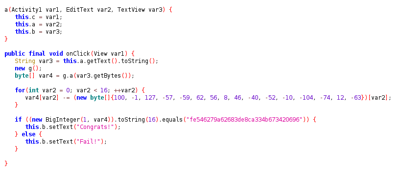
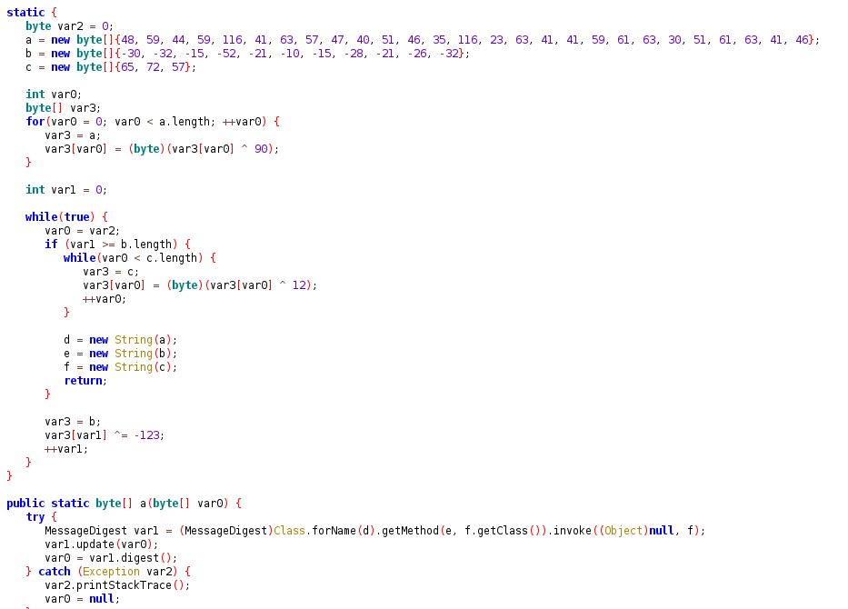
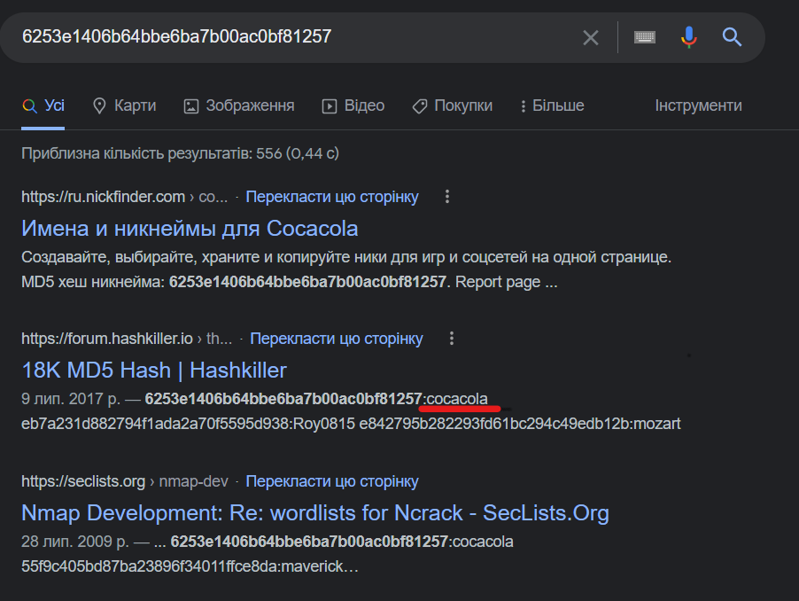

# Android 1

### The main idea was to discover that main class of the task (class a) uses the class g to create input for the for-cycle. After the cycle the results then is compared to "fe546279a62683de8ca334b673420696"

### Lets take a closer look at class g. We can discover 3 arrays with decimals. After performing operations on the we'll see that they are strings containing   "java.security.MessageDigest","getInstance", "MD5". So class g is needed to get MD5 hash of the inpud data.

### Hashing is not revertible, so even when we get the hash value we cannot get the original data. Hovewer, we can try to google that hash value or etc.

flag: CTF_FLAG{cocacola}