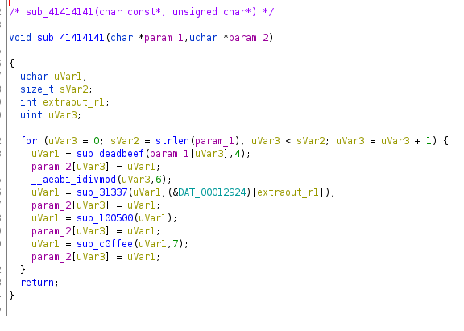

# Android 2

## In activity 2 we can spot that it uses library called libsome.so

## After reverse-engineering in Ghidra was discovered that is consists 4 functions.

## Those functions can be recreated in Python using. To speed up the process we can use [cffi](https://cffi.readthedocs.io/en/latest/) module. This allows us to recreate that library from C pseudo-code (code to recreate library is in [./resouses/helper.py](./resources/helper.py)).

```python
from _Android_3 import lib


check = [0x69, 0xa7, 0x55, 0xf3, 0x03, 0x60, 0x4f, 0xa6, 0xb5, 0x35, 0xc3, 0xe0, 0x89, 0x46]
check2 = [0xad, 0x3a, 0x12, 0x90, 0x19, 0x99]

print("::STARTING::")
for x in range(14):
    temp = 0
    for y in range(256):
        temp = lib.sub_deadbeef(y, 4)
        temp = lib.sub_31337(temp, check2[x%6])
        temp  = lib.sub_100500(temp)
        temp  = lib.sub_c0ffee(temp, 7)
        if temp == check[x]:
            print(chr(y), end = '')
            break
```

flag: CTF_FLAG{native_is_pain}
