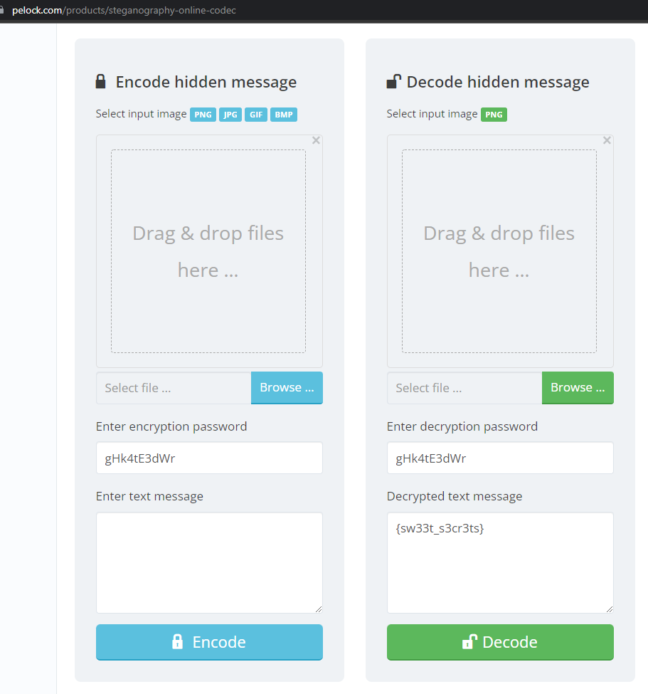

```bash
┌──(kali㉿kali)-[~/Downloads]
└─$ strings image_1.png | head
IHDR
        pHYs
LeXIfMM
cGFzczogZ0hrNHRFM2RXcg==
IDATx
duWfDf
$i$z/
~^n\
0 yT
u~.}
```

```python
In [1]: import base64

In [2]: base64.b64decode("cGFzczogZ0hrNHRFM2RXcg==").decode('utf-8')
Out[2]: 'pass: gHk4tE3dWr'

```

https://www.pelock.com/products/steganography-online-codec


flag CTF_FLAG{{sw33t_s3cr3ts}