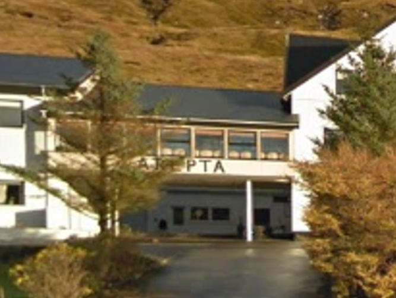
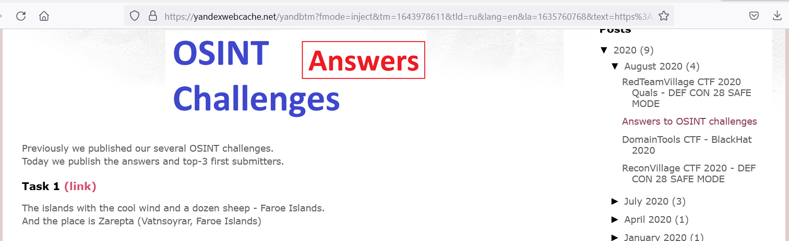
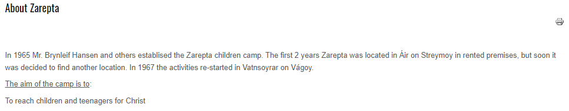
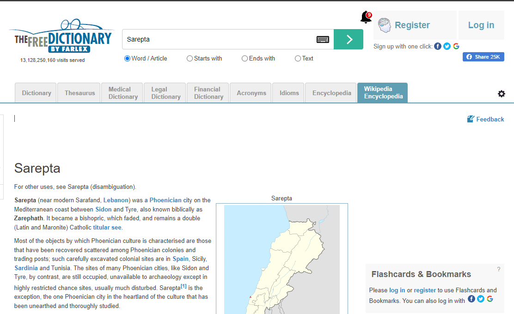

The islands with the cool wind and a dozen sheep - Faroe Islands.  
And the place is Zarepta (Vatnsoyrar, Faroe Islands)

Task's picure can be found on the internet via Bing image search.

The initial task was on the site which is no longer available, but we can recover it from Yandex cache.

The other way of solving in Sherlock Holmes style:

on the original pic we can see letters "arepta"

so the most probable fist letter is "s"

Sarepta is a biblical city Zarephath. Considering this fact and the payground in the foreground we can suggets it to be some sort of a camp for christian children. S becomes Z, and we have found our target.

flag: CTF_FLAG{Zarepta_Vatssoyrar}
