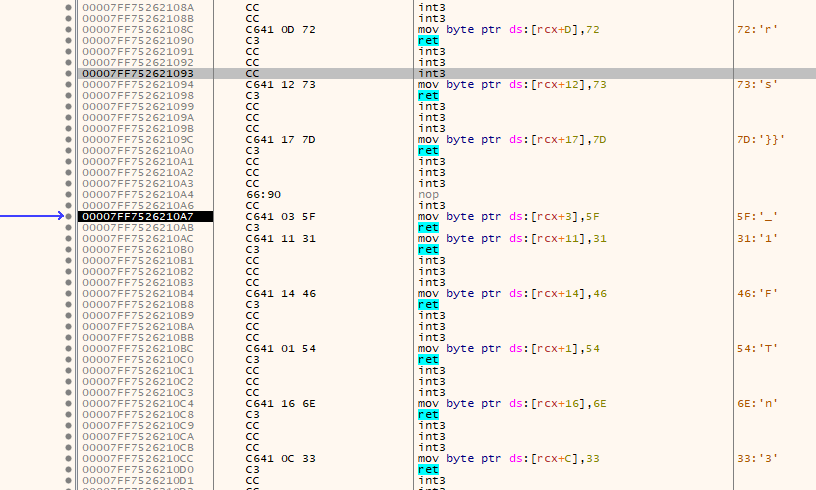

using x64dbg skip with F9 to entry point of the packed data, then extract the flag ([guide](https://www.varonis.com/blog/x64dbg-unpack-malware))

after we can manually extract the flag

flag: CTF_FLAG{R3v3rs3_1s_Fun}