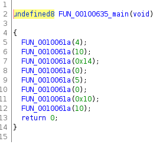
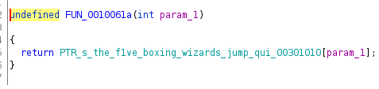

# get element by index



```python
string = "the f1ve boxing wizards jump quickly"
indexes = [4, 10, 0x14, 0, 5, 0, 0x10, 10]
for i in indexes:

 print(string[i], end = '')
```

flag: CTF_FLAG{fort1two}