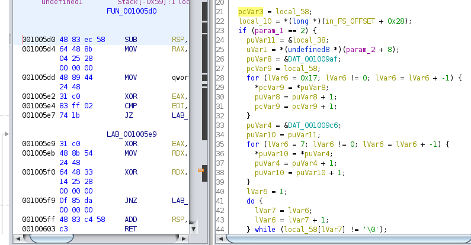
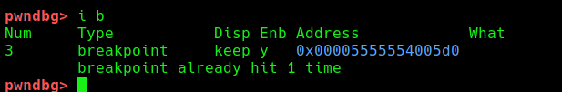
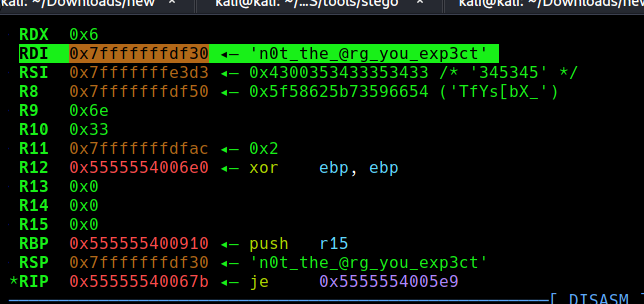
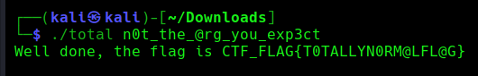

## using pwndbg we can find the string to which input is compader to 




```
0x55555540067b 
RDI  0x7fffffffdf30 ◂— 'n0t_the_@rg_you_exp3ct'
```
## after we can pass it as input to get a flag


flag: CTF_FLAG{T0TALLYN0RM@LFL@G}

