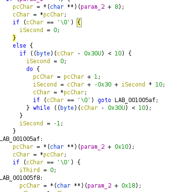
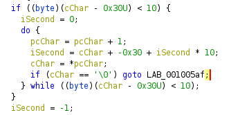
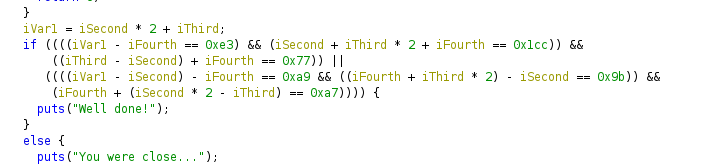
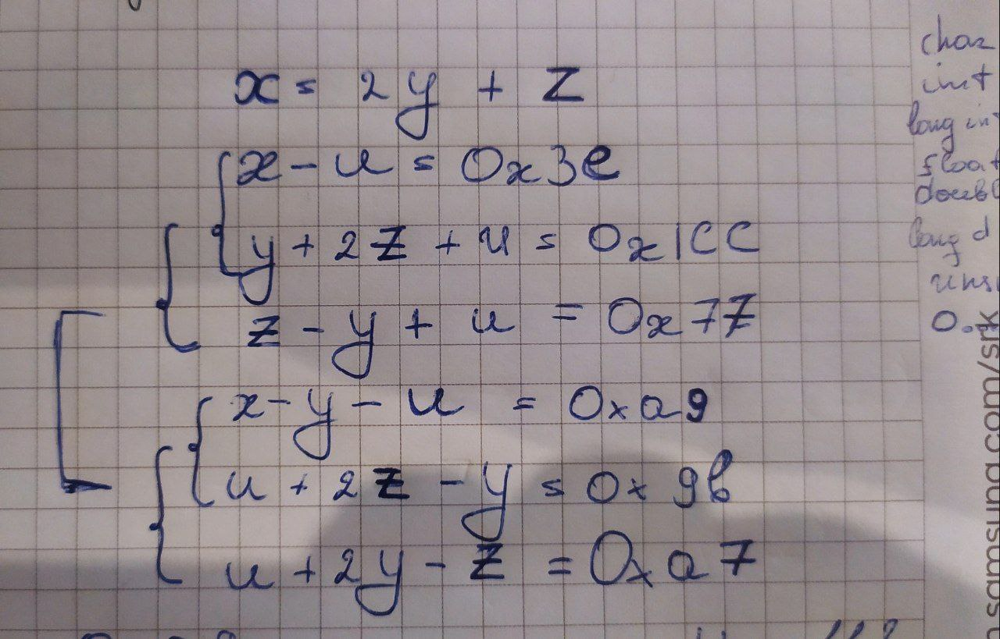
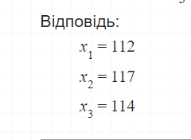
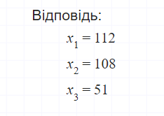

from `param_2 +8/16/24` we can decude that there should be 3 arguments containing 3 chars + `\0` 



cycle to turn string to number



set of operations, from which we can get two systems of linear equations




```python
In [24]: chr(112)
Out[24]: 'p'

In [25]: chr(117)
Out[25]: 'u'

In [26]: chr(114)
Out[26]: 'r'

In [27]: chr(112)
Out[27]: 'p'

In [28]: chr(108)
Out[28]: 'l'

In [29]: chr(51)
Out[29]: '3'
```

flag: CTF_FLAG{purpl3}