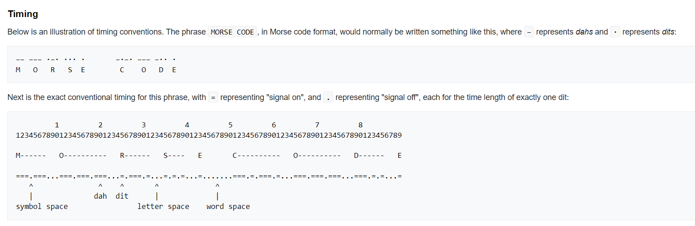

time-based morse encoding
 

```
-=-===---===-=---=---===-=---===-=-=-===-=-=-===-=-===---=---===-=---=---=-===-=---=-=-===-
'=' to '.'
-.-...---...-.---.---...-.---...-.-.-...-.-.-...-.-...---.---...-.---.---.-...-.---.-.-...-
'...' to '_'
-.-_---_-.---.---_-.---_-.-.-_-.-.-_-.-_---.---_-.---.---.-_-.---.-.-_-
'.' to '@'
-@-_---_-@---@---_-@---_-@-@-_-@-@-_-@-_---@---_-@---@---@-_-@---@-@-_-
'---' to '-'
.@._-_.@-@-_.@-_.@.@._.@.@._.@._-@-_.@-@-@._.@-@.@._.
remove '@'
.._-_.--_.-_..._..._.._--_.--._.-.._.
'_' to ' '
.. - .-- .- ... ... .. -- .--. .-.. .
```

flag: CTF_FLAG{itwassimple}
