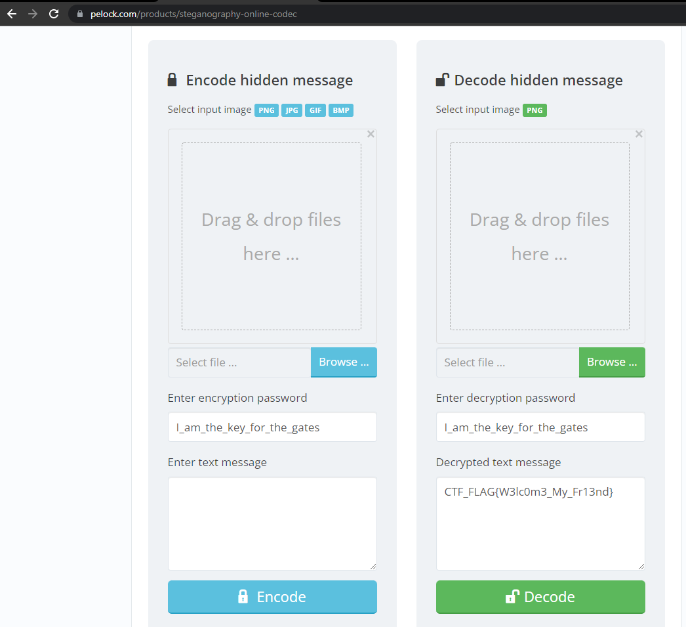

```bash
┌──(kali㉿kali)-[~/Downloads]
└─$ strings gates.png | head
IHDR
        pHYs
eXIfMM
0232
0100
ASCII
I_am_the_key_for_the_gates
IDATx
@"o_
CC$;|vx
```

https://www.pelock.com/products/steganography-online-codec


flag CTF_FLAG{W3lc0m3_My_Fr13nd}